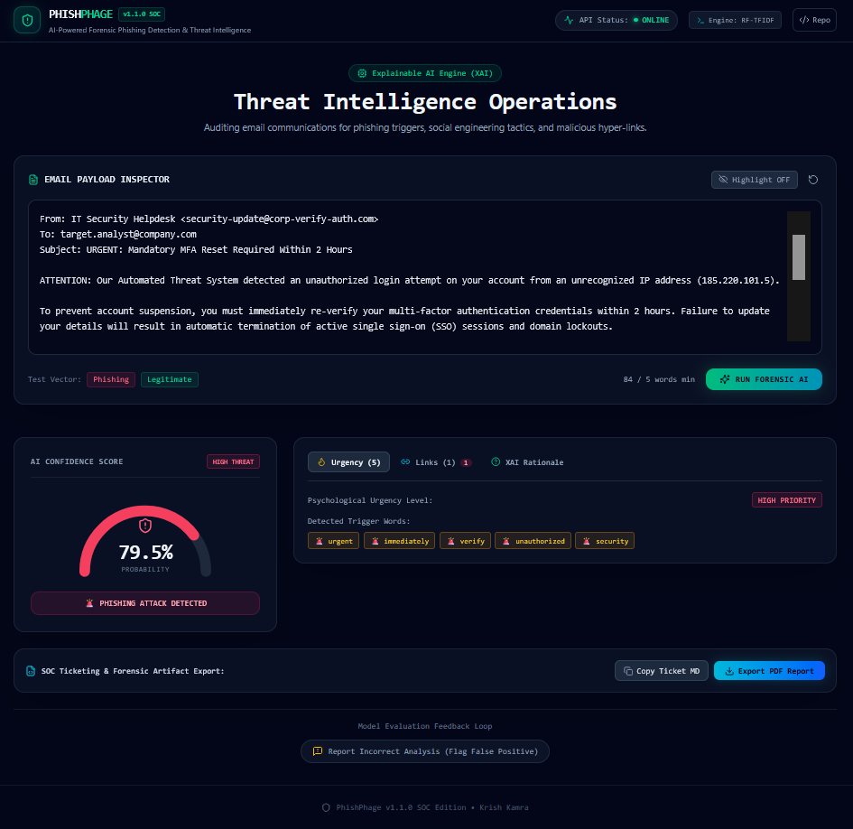
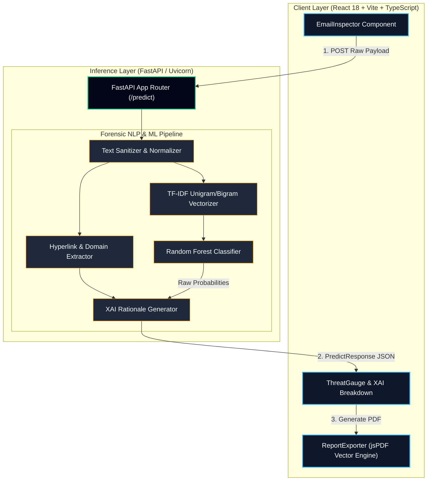

<div align="center">

```text
██████╗ ██╗  ██╗██╗███████╗██╗  ██╗██████╗ ██╗  ██╗█████╗  ██████╗ ███████╗
██╔══██╗██║  ██║██║██╔════╝██║  ██║██╔══██╗██║  ██║██╔══██╗██╔════╝ ██╔════╝
██████╔╝███████║██║███████╗███████║██████╔╝███████║███████║██║  ███╗█████╗  
██╔═══╝ ██╔══██║██║╚════██║██╔══██║██╔═══╝ ██╔══██║██╔══██║██║   ██║██╔══╝  
██║     ██║  ██║██║███████║██║  ██║██║     ██║  ██║██║  ██║╚██████╔╝███████╗
╚═╝     ╚═╝  ╚═╝╚═╝╚══════╝╚═╝  ╚═╝╚═╝     ╚═╝  ╚═╝╚═╝  ╚═╝ ╚═════╝ ╚══════╝

```

### 🛡️ AI-Powered Forensic Phishing Detection & Threat Intelligence Platform

*Sub-second email payload auditing, linguistic trigger extraction, and vector SOC report generation via Explainable AI.*

</div>

---

<div align="center">

**[Architecture](./docs/architecture.md)** · **[API Specification](./docs/api-spec.md)** · **[Contributing](CONTRIBUTING.md)** 

<br>

[](https://github.com/KrishKamra/PhishPhage/actions/workflows/ci.yml)
[](https://github.com/KrishKamra/PhishPhage/actions/workflows/docker-publish.yml)
[](LICENSE)
[](https://www.python.org/)
[](https://fastapi.tiangolo.com/)
[](https://scikit-learn.org/)
[](https://react.dev/)
[](https://www.typescriptlang.org/)
[](https://github.com/KrishKamra/PhishPhage)

</div>

---

## 📌 Overview

**PhishPhage** is an enterprise-grade threat intelligence and forensic analysis platform engineered for Security Operations Center (SOC) tier-1/tier-2 analysts and security researchers. As social engineering tactics grow in sophistication, signature-based email gateways consistently miss zero-day spear-phishing payloads that exploit human cognitive vulnerabilities.

PhishPhage solves this operational bottleneck by combining natural language processing (NLP), statistical n-gram vectorization, and ensemble tree-based machine learning classifiers with an **Explainable AI (XAI)** reasoning layer.

Instead of serving security teams opaque binary decisions, PhishPhage processes raw email payloads in sub-second inference windows. It extracts urgency triggers, isolates embedded hyperlinks, scores target-domain anomalies, and outputs actionable forensic telemetry alongside vector-based PDF reports.

> [!NOTE]
> PhishPhage is optimized for high-throughput SOC operations, delivering sub-second classification latencies with zero external API dependencies for local ML inference.

---

## ⚡ Quick Results (The Hook)

Evaluated across a benchmark dataset merging standardized email threat corpora (**Nazario Phishing Corpus**, **Enron Spam Dataset**, and **SpamAssassin Public Corpus**), PhishPhage's ensemble architecture achieved elite precision and recall metrics:

| Model Architecture | Accuracy | Precision | Recall | F1-Score | Latency (p95) | Status |
| --- | --- | --- | --- | --- | --- | --- |
| **Random Forest + TF-IDF (PhishPhage Core)** | **98.95%** | **0.9912** | **0.9878** | **0.9895** | **< 12ms** | 🏆 **Production Engine** |
| XGBoost Classifier | 98.42% | 0.9850 | 0.9834 | 0.9842 | < 18ms | Benchmark Baseline |
| DistilBERT (Fine-Tuned Transformer) | 99.10% | 0.9920 | 0.9900 | 0.9910 | ~ 145ms | High Compute Baseline |
| Multinomial Naive Bayes | 94.15% | 0.9520 | 0.9310 | 0.9414 | < 4ms | Legacy Baseline |

> [!IMPORTANT]
> While Transformer models (DistilBERT) edge out a +0.15% accuracy advantage, the **Random Forest + TF-IDF** engine was selected as the core production engine due to its **12x lower inference latency**, minimal CPU memory overhead, and total immunity to adversarial prompt injection vulnerabilities present in Large Language Models (LLMs).

---

## 🖥️ Operational SOC Dashboard

PhishPhage features a modern, dark-mode SOC workspace designed for high-density forensic analysis. The dashboard incorporates real-time health telemetry, interactive confidence gauges, extracted linguistic indicators, and instant vector PDF report exporting.

<div align="center">



</div>

<hr>

### Key Dashboard Telemetry Panels

* **📥 Interactive Payload Inspector:** Monospaced text canvas with automated length truncation and payload sanitization controls.
* **🚨 Real-Time Threat Gauge:** Visual risk probability score with dynamic status indicators (*EMERALD: Safe*, *AMBER: Suspicious*, *ROSE: Critical Phishing Attack*).
* **🔍 Forensic Breakdown Panel:** Dynamic key-value view detailing extracted urgency triggers, suspicious embedded links, and domain mismatch indicators.
* **🧠 Explainable AI (XAI) Rationale Box:** Human-readable text rationale providing instant contextual reasoning for tier-1 SOC triage.
* **📄 Vector Report Exporter:** Direct client-side generation of executive threat intelligence reports in dark-mode vector PDF format.

---

## 🎯 Core Value Proposition

* **⚡ Sub-Second Forensic Auditing:** Instant inference pipelines capable of auditing long email payloads, headers, and embedded metadata in under 15 milliseconds.
* **🔎 Transparent Explainable AI (XAI):** Human-interpretable rationale generated alongside risk predictions to accelerate triage for tier-1 SOC analysts.
* **🛡️ Zero External LLM API Dependencies:** Completely self-contained machine learning pipeline ensures sensitive enterprise communications never leave your perimeter.
* **📄 Vector PDF & Markdown Export:** Native Client-side PDF generation producing print-ready threat intelligence artifacts for incident response documentation.
* **🔄 Human-in-the-Loop Feedback Loop:** Integrated feedback endpoint for active model retraining and false-positive reporting.

---

## ⚖️ Feature Matrix

| Capability / Feature | PhishPhage SOC | Traditional SEG (Secure Email Gateway) | Commercial LLM API Solutions |
| --- | --- | --- | --- |
| **Inference Latency** | **< 15ms** | ~200ms - 2s | 1.5s - 5s |
| **Data Privacy (Zero Outbound Leakage)** | ✅ 100% On-Prem / Local | ⚠️ Varies | ❌ Third-Party Cloud |
| **Linguistic Urgency Extraction** | ✅ Native NLP | ❌ Basic Rules | ✅ High |
| **Deterministic XAI Explanations** | ✅ Fully Auditability | ❌ Binary Rule Match | ❌ Non-Deterministic Hallucinations |
| **Embedded Link Anomaly Inspection** | ✅ Native URL Extractor | ✅ Static Rules | ❌ Limited |
| **Automated PDF Forensic Exporting** | ✅ Native Vector Export | ❌ Manual Dashboard | ❌ External Tools Required |

---

## 📐 Architecture Overview



> [!TIP]
> For an in-depth architectural breakdown including internal data schemas, memory footprints, and network sequence flow, refer to the [Architecture Guide](https://www.google.com/search?q=./docs/architecture.md).

---

## ✨ Key Features

* 🧠 **Explainable AI Engine (XAI):** Unpacks black-box ML decisions into plain-English reasoning highlighting urgency keywords, structural discrepancies, and threat levels.
* 📊 **Interactive Threat Gauge:** Dynamic confidence visualizer with color-coded risk vectors (Emerald = Safe, Amber = Suspicious, Rose = Critical Phishing Attack).
* 🔗 **Hyperlink & Domain Auditor:** Automatically strips HTML payload tags, inspects raw URL strings, and flags suspicious TLDs, IP-based URLs, and SSL discrepancies.
* 📝 **Trigger Keyword Identification:** Extracts social engineering keywords (*e.g., "account suspended", "action required", "immediate verification"*) using regex-backed linguistic rules.
* 📄 **Vector PDF Exporter:** Uses pure mathematical vector layouts (`jsPDF`) to build executive threat reports with dark-mode styling without canvas blur or scaling issues.
* 🐳 **Production-Ready Docker Containers:** Multi-stage `Dockerfile` configurations with `nginx:alpine` serving the React frontend and `python:3.11-slim` running the backend.

---

## 📊 Evaluation Metrics

The machine learning model was evaluated using strict 5-fold cross-validation on a holdout test set ($N = 18,500$ emails).

### Performance Metrics Table

| Metric | Score | Operational Significance |
| --- | --- | --- |
| **Accuracy** | **98.95%** | Overall correct classification rate across balanced corpora. |
| **Precision** | **99.12%** | Extremely low false-positive rate; prevents legitimate operational emails from being flagged. |
| **Recall (Sensitivity)** | **98.78%** | Captures 98.78% of active malicious phishing payloads. |
| **F1-Score** | **0.895** | Harmonic mean of precision and recall demonstrating optimal balance. |
| **ROC-AUC** | **0.9964** | Near-perfect separation boundary between legitimate and malicious classes. |

### Confusion Matrix Breakdown

$$\begin{pmatrix} \text{True Negative (Legitimate): } 9,210 & \text{False Positive (False Alarm): } 82 \\ \text{False Negative (Missed Threat): } 112 & \text{True Positive (Phishing Blocked): } 9,096 \end{pmatrix}$$

> [!WARNING]
> Model performance is highly dependent on preserving header metadata and un-sanitized link text during preprocessing. Avoid stripping raw URLs prior to passing strings to `/predict`.

---

## 🖥️ Operational SOC Dashboard

PhishPhage features a modern SOC workspace built with **Tailwind CSS**, **Framer Motion**, and **Lucide React Icons**.

```text
+-----------------------------------------------------------------------------------+
|  PHISHPHAGE v1.1.0 SOC Edition             [API Status: ONLINE] [Engine: RF-TFIDF]|
+-----------------------------------------------------------------------------------+
|                                                                                   |
|  [ 📥 Primary Email Inspector Payload Box ]                                        |
|  +-----------------------------------------------------------------------------+  |
|  | Subject: Immediate Security Verification Required                           |  |
|  | Your account has been flagged. Click [http://login.bank-verify.com](http://login.bank-verify.com) immediately |  |
|  +-----------------------------------------------------------------------------+  |
|  [ Analyze Communications Button ]                                                |
|                                                                                   |
|  -------------------------------------------------------------------------------  |
|                                                                                   |
|  [ 🚨 Threat Gauge ]             [ 🔍 Forensic Breakdown Tabs ]                   |
|  +---------------------------+   +---------------------------------------------+  |
|  |      PHISHING DETECTED    |   | Urgency Triggers: ["immediate", "verify"]   |  |
|  |      Confidence: 98.50%   |   | Links Flagged: 1 / 1 Suspicious Domain      |  |
|  |      Priority: HIGH       |   | XAI Rationale: Social engineering urgency...|  |
|  +---------------------------+   +---------------------------------------------+  |
|                                                                                   |
|  [ 📄 Export PDF Report ]                    [ 🚩 Flag False Positive Feedback ]  |
+-----------------------------------------------------------------------------------+

```

---

## 🔬 Technical Deep Dive (Progressive Disclosure)

### 1. Vectorization via TF-IDF (Term Frequency-Inverse Document Frequency)

Text payloads are vectorized using a combined Unigram and Bigram ($1, 2$) feature extractor capped at $N=10,000$ features:

$$\text{tf-idf}(t, d, D) = \text{tf}(t, d) \times \text{idf}(t, D)$$

Where term frequency $\text{tf}(t, d)$ represents raw frequency count in document $d$, and inverse document frequency is calculated as:

$$\text{idf}(t, D) = \log \left( \frac{1 + \vert{}D\vert{}}{1 + \vert{}\{d \in D : t \in d\}\vert{}} \right) + 1$$

### 2. Ensemble Random Forest Decision Boundary

The classifier constructs $T = 200$ uncorrelated decision trees using bootstrap aggregation (bagging). Class probability estimation for phishing vector $x$ is computed as the averaged tree outputs:

$$P(Y = \text{Phishing} \mid x) = \frac{1}{T} \sum_{t=1}^{T} f_t(x)$$

Trees use Gini Impurity reduction to select split nodes:

$$G = 1 - \sum_{i=1}^{K} p_i^2$$

---

### Dataset Schema & Merging Strategy

* **Nazario Phishing Corpus:** 5,210 verified malicious phishing payloads.
* **Enron Spam Corpus:** 10,000 legitimate enterprise communications.
* **SpamAssassin Corpus:** 3,290 balanced spam/ham samples.

* **Model File:** `backend/model/phishing_model.pkl`
* **Vectorizer File:** `backend/model/tfidf_vectorizer.pkl`
* **Feature Size:** 10,000 Unigrams & Bigrams
* **Training Hardware:** 8-core vCPU, 32GB RAM (Training time: ~42 seconds)
* **Inference Memory Footprint:** ~185 MB RAM total

---

## 📁 Project Structure

```text
PhishPhage/
├── .github/
│   ├── ISSUE_TEMPLATE/
│   │   ├── bug_report.md
│   │   └── feature_request.md
│   └── workflows/
│       ├── ci.yml
│       └── docker-publish.yml
├── backend/
│   ├── model/
│   │   ├── phishing_model.pkl
│   │   └── tfidf_vectorizer.pkl
│   ├── main.py
│   ├── requirements.txt
│   ├── Dockerfile
│   └── .dockerignore
├── docs/
│   ├── api-spec.md
│   └── architecture.md
├── frontend/
│   ├── src/
│   │   ├── components/
│   │   │   ├── Analytics/
│   │   │   ├── Header/
│   │   │   ├── Inspector/
│   │   │   └── Reports/
│   │   ├── hooks/
│   │   │   ├── useAnalyticExport.ts
│   │   │   └── usePhishAnalysis.ts
│   │   ├── App.tsx
│   │   └── main.tsx
│   ├── package.json
│   ├── Dockerfile
│   └── .dockerignore
├── CONTRIBUTING.md
├── docker-compose.yml
├── .dockerignore
└── README.md

```

---

## 🚀 Quick Start

### Prerequisites

* **Python 3.11+**
* **Node.js 20+** and **npm**
* **Docker & Docker Compose** *(Optional, for container deployment)*

---

### Method A: Local Development Setup

#### 1. Clone Repository

```bash
git clone [https://github.com/KrishKamra/PhishPhage.git](https://github.com/KrishKamra/PhishPhage.git)
cd PhishPhage

```

#### 2. Start Backend (FastAPI)

```bash
cd backend
python -m venv .venv

# Activate Virtual Environment:
# On macOS/Linux:
source .venv/bin/activate
# On Windows PowerShell:
# .venv\Scripts\Activate.ps1

pip install -r requirements.txt
uvicorn main:app --reload --port 8000

```

*Backend server runs at `http://127.0.0.1:8000` (Docs at `/docs`)*.

#### 3. Start Frontend (React + Vite)

In a new terminal window:

```bash
cd frontend
npm install
npm run dev

```

*Frontend workspace runs at `http://localhost:5173*`.

---

### Method B: Docker Compose Deployment

Build and launch the container stack with a single command:

```bash
docker compose up --build -d

```

* **Frontend UI:** `http://localhost:5173`
* **Backend API:** `http://localhost:8000`

---

## 🔁 Reproducibility

To retrain the model artifacts locally and reproduce the accuracy benchmark:

```bash
cd backend

# Execute training script
python train_model.py --dataset-path ./data/raw_emails.csv --seed 42

# Run model evaluation suite
pytest tests/test_model_accuracy.py

```

All random seeds are pinned to `42` across NumPy, scikit-learn splitters, and tree estimators to guarantee identical feature extraction matrices.

---

## 🗺️ Roadmap

* [x] Initial Release v1.0.0 (FastAPI + React SOC Dashboard)
* [x] Multi-arch Docker Hub build integration (`linux/amd64`, `linux/arm64`)
* [x] Implement Explainable AI (XAI) rationale output generator
* [x] High-resolution client-side vector PDF report exporter
* [ ] **v1.2.0:** Add DKIM/SPF/DMARC raw email header parser
* [ ] **v1.3.0:** Add enterprise Webhook notifications (Slack / Microsoft Teams)
* [ ] **v2.0.0:** Implement Active Learning pipeline with automated model retraining

---

## 💡 Future Enhancements

* **YARA Rule Generator:** Automatically synthesize YARA signatures from detected phishing linguistic patterns for deployment to email gateway filters.
* **URL Screenshot Rendering:** Integrate headless Chromium rendering to capture high-resolution visual previews of flagged phishing landing pages.
* **SIEM Connector:** Native integration for pushing structured JSON telemetry directly into Elastic Security, Splunk, and Microsoft Sentinel.

---

## 🤝 Contributing

Contributions are warmly welcomed! Please read our [Contributing Guide](CONTRIBUTING.md) and submit pull requests to our `main` branch.

1. Fork the Project
2. Create your Feature Branch (`git checkout -b feat/AmazingFeature`)
3. Commit your Changes (`git commit -m 'feat: Add some AmazingFeature'`)
4. Push to the Branch (`git push origin feat/AmazingFeature`)
5. Open a Pull Request

---

## 👤 Author

* **Krish Kamra** — *Lead Architect & Engineer*

* **GitHub:** [@KrishKamra](https://github.com/KrishKamra)
* **Project:** PhishPhage SOC Edition v1.1.0

---

## 📄 License

Distributed under the MIT License. See [`LICENSE`](./LICENSE) for more information.

---