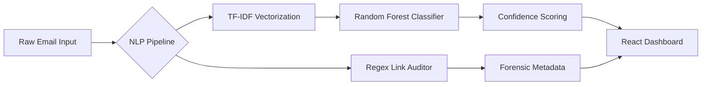

# 🛡️ PhishPhage: AI-Powered Phishing Detection & Forensic Auditor

### **Precision Cybersecurity via Explainable NLP & Threat Intelligence**

-----

## 📖 Overview

PhishPhage is an end-to-end machine learning ecosystem designed to intercept, analyze, and deconstruct phishing attempts with surgical precision. Unlike traditional "black-box" filters, PhishPhage bridges the gap between raw classification and actionable security auditing.

The core mission is **Explainable AI (XAI)**. By utilizing advanced Natural Language Processing (NLP), PhishPhage identifies the specific linguistic triggers and social engineering tactics used by attackers. It provides security teams with a real-time **Threat Intelligence Dashboard** that explains the *why* behind every detection, enabling faster forensic responses.

-----

## 💎 Core Value Proposition

| Feature | Impact | Business Value |
| :--- | :--- | :--- |
| 🛡️ **99% Spam Recall** | Near-zero threat leakage. | Mitigates million-dollar breach risks. |
| ✅ **100% Ham Precision** | No false positives for business mail. | Zero disruption to employee productivity. |
| 🔍 **Forensic Highlights** | Visual linguistic trigger mapping. | Instant auditing for non-technical users. |
| ⚡ **FastAPI Inference** | Millisecond response times. | Seamless integration into live mail flows. |

-----

## 📐 Architecture Overview



### **Architectural Highlights**

  * **Decoupled Stack:** React-based UI with an asynchronous Python backend.
  * **Vectorization Layer:** Utilizing `TfidfVectorizer` with n-gram support for deep contextual analysis.
  * **Hybrid Analysis:** Combining statistical Machine Learning with heuristic forensic rules.
  * **State Management:** Optimized React hooks for millisecond UI updates during live inference.

-----

## 🛠️ Technical Deep Dive

### **Core Components**

| Component | Technology | Role |
| :--- | :--- | :--- |
| **Inference Engine** | FastAPI | High-throughput async REST API. |
| **ML Model** | Scikit-learn (RF) | Ensemble learning for robust classification. |
| **NLP Toolkit** | NLTK | Tokenization, lemmatization, and stop-word filtering. |
| **Persistence** | Joblib / Serialization | Optimized artifact loading for ML pipelines. |
| **Design System** | Tailwind + Framer Motion | High-fidelity Glassmorphism & UI feedback. |

### **Security Model**

  * **Forensic Minimum:** Implements a 5-word context threshold to prevent adversarial "hallucinations."
  * **Link Sanitization:** Heuristic evaluation of raw IPs and unencrypted protocols (HTTP).
  * **Zero-Storage Policy:** Designed for stateless inference to maintain user data privacy.

-----

## ✨ Key Features

  * 🎯 **Linguistic Trigger Mapping:** Real-time highlighting of suspicious vocabulary (e.g., *urgent*, *verify*) within the dashboard.
  * ⚖️ **Urgency Leveling:** Dynamic categorization of social engineering tactics (High/Medium/Low).
  * 📑 **Forensic Export:** Generates standardized IT security reports for internal ticketing.
  * 🔄 **Human-in-the-Loop:** Integrated feedback mechanism to simulate active ML retraining loops.
  * 🌐 **Vulnerability Parser:** Deep-links evaluation flagging lookalike domains and IP-based URLs.

-----

## 📂 Project Structure

```text
PhishPhage/
├── backend/                # FastAPI logic & ML artifacts
│   ├── main.py             # REST API & Forensic Engine
│   ├── artifacts/          # Optimized .joblib Model & Vectorizer
│   └── requirements.txt    # Pinned production dependencies
├── frontend/               # React (Vite) Single-Page Application
│   ├── src/
│   │   ├── App.tsx         # Dashboard & Forensic UI
│   │   └── main.tsx        # React DOM entry point
│   └── package.json        # Frontend manifest
└── ml_pipeline/            # Research & Model Engineering
    ├── datasets/           # Labeled Phishing/Ham corpora
    ├── notebooks/          # Exploratory Data Analysis (EDA)
    └── train_model.py      # Automated training & optimization script
```

-----

## 💻 Quick Start

### **1. Clone & Rebrand**

```bash
git clone https://github.com/KrishKamra/PhishPhage.git
cd PhishPhage
```

### **2. Backend Initialization**

```bash
cd backend
python -m venv .venv
source .venv/bin/activate  # Windows: .venv\Scripts\activate
pip install -r requirements.txt
uvicorn main:app --reload
```

*API accessible at:* `http://127.0.0.1:8000`

### **3. Frontend Initialization**

```bash
cd ../frontend
npm install
npm run dev
```

*Dashboard accessible at:* `http://localhost:5173`

-----

## 🗺️ Roadmap

  - [x] **v1.1.0**: Rebranding, Joblib optimization, and Forensic UI rollout.
  - [ ] **v1.2.0**: Dockerization & Multi-stage container builds for easy deployment.
  - [ ] **v1.5.0**: Browser Sentinel (Chrome Extension) for real-time Gmail auditing.
  - [ ] **v2.0.0**: LLM Integration (Small-parameter models like Phi-3) for nuance detection.

-----

## 🚀 Future Enhancements

  * **Multi-Model Support:** Native integration for XGBoost and LightGBM ensembles.
  * **Advanced Heuristics:** Email header analysis and DKIM/SPF verification checks.
  * **API Ecosystem:** Headless endpoint support for Enterprise Security Operations Centers (SOC).

-----

## 👨‍💻 Author

**Krish Kamra**

-----

## ⚖️ License

Distributed under the **MIT License**. See `LICENSE` for more information.
