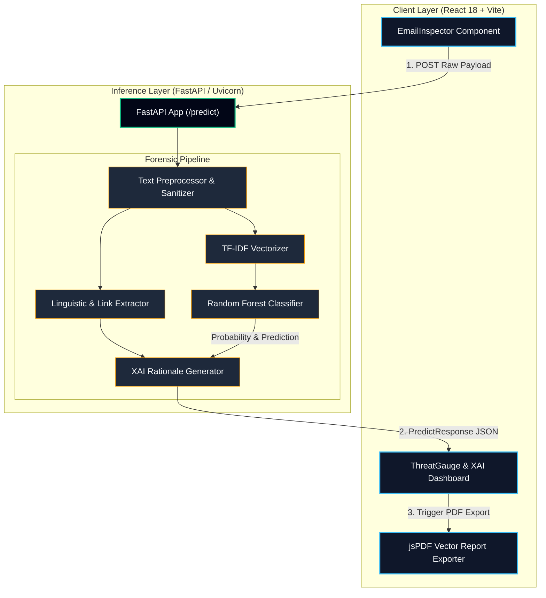
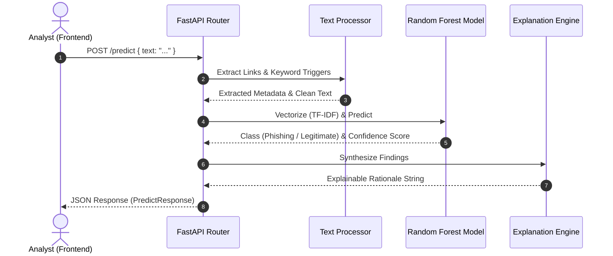
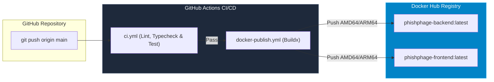

# 🏛️ PhishPhage Architecture & Technical Blueprint

PhishPhage is an enterprise-ready, Explainable AI (XAI) security platform designed for Security Operations Center (SOC) teams. It inspects incoming email communications for phishing indicators, social engineering tactics, and malicious hyper-links using machine learning classifiers and natural language processing (NLP).

---

## 📐 System Architecture Overview

The following diagram illustrates the end-to-end telemetry flow—from client-side input through the FastAPI machine learning inference pipeline down to PDF/Markdown report generation.



---

## ⚡ Core Operational Components

### 1. Frontend Workspace (`/frontend`)

Built using **React 18**, **TypeScript**, and **Tailwind CSS v4**, the user interface provides real-time forensic feedback without triggering full page re-renders.

> [!NOTE]
> The UI includes smooth-scroll capabilities powered by Lenis inertia scrolling and reactive components styled with Framer Motion.

* **EmailInspector:** Captures raw headers, subject lines, and email bodies for forensic analysis.
* **ThreatGauge:** Visualizes threat probability scores with dynamic color-coded urgency thresholds.
* **ForensicBreakdown:** Displays extracted linguistic trigger keywords, suspicious link structures, and Explainable AI rationale.
* **ReportExporter:** Utilizes native `jsPDF` vector commands to assemble dark-mode SOC threat intelligence reports without canvas rasterization artifacts.

---

### 2. Machine Learning Inference Engine (`/backend`)

The backend is driven by **FastAPI** and **scikit-learn**, running asynchronously inside Uvicorn.



> [!IMPORTANT]
> The Random Forest model evaluates TF-IDF feature matrices trained on phishing corpora, combining statistical feature weights with structural heuristics (such as urgency indicators and domain mismatches).

---

## 🛠️ Data Pipeline & Response Schema

When an email is analyzed, the backend returns a strongly-typed JSON structure matching the schema below:

```json
{
  "is_phishing": true,
  "confidence": "94.20%",
  "prediction": "Phishing",
  "explanation": "High probability of phishing detected due to suspicious linguistic urgency triggers ('immediately', 'account locked') combined with mismatched domain hyperlinks.",
  "analysis": {
    "urgency_level": "High",
    "trigger_words_found": ["immediately", "verify", "locked", "action required"],
    "total_links_found": 2,
    "link_details": [
      {
        "url": "[http://login.secure-bank-verify.com/login](http://login.secure-bank-verify.com/login)",
        "is_suspicious": true,
        "reason": "Mismatched domain SSL structure / IP-based link"
      }
    ]
  }
}

```

> [!WARNING]
> PDF export relies strictly on optional-chaining property extractors (`data?.analysis?.trigger_words_found ?? []`) to ensure exports complete successfully even if payload properties are partially omitted.

---

## 🐳 Containerization & CI/CD Deployment

PhishPhage is fully dockerized with multi-stage builds and automated CI/CD pipelines.



> [!TIP]
> You can deploy the complete stack locally using Docker Compose:
> ```bash
> docker compose up --build -d
> 
> ```
> 
> 

---